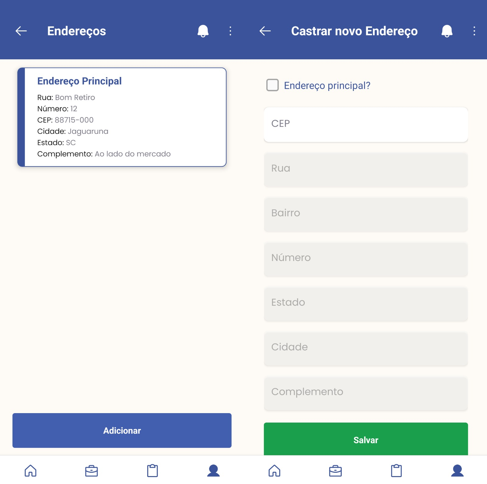

# Contratei - Frontend

Este é o frontend de um aplicativo para exposição e busca de serviços terceirizados. O projeto foi desenvolvido como Trabalho de Conclusão de Curso (TCC) para o bacharelado em Ciência da Computação, por **Phelipe Nandi**, em parceria com **Laus Vandresen**, responsável pela parte do backend. O sistema disponibiliza funcionalidades completas para cadastro, busca e gerenciamento de serviços oferecidos por terceiros. O aplicativo foi desenvolvido com o framework React Native, utilizando as bibliotecas Expo e Native Base para garantir eficiência e uma interface moderna.
A parte do backend do projeto pode ser encontrada [aqui](https://github.com/Laus-Vandresen/contratei-backend).

## Tecnologias Utilizadas

- **React 18**
- **React Native 0.69.6**
- **TypeScript**
- **Expo**
- **Native Base**
- **React Navigation**
- **React Hook Form**
- **React Query**
- **Axios**
  
## Imagens do Aplicativo

